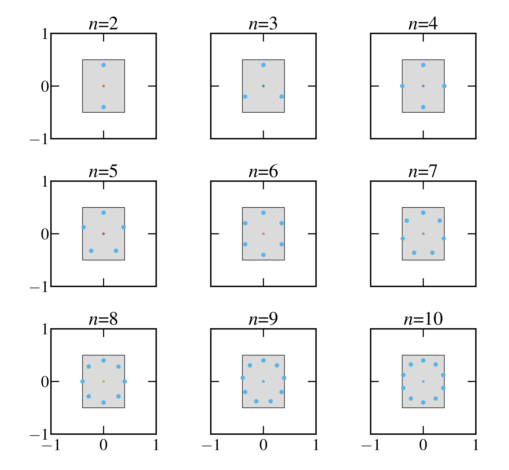
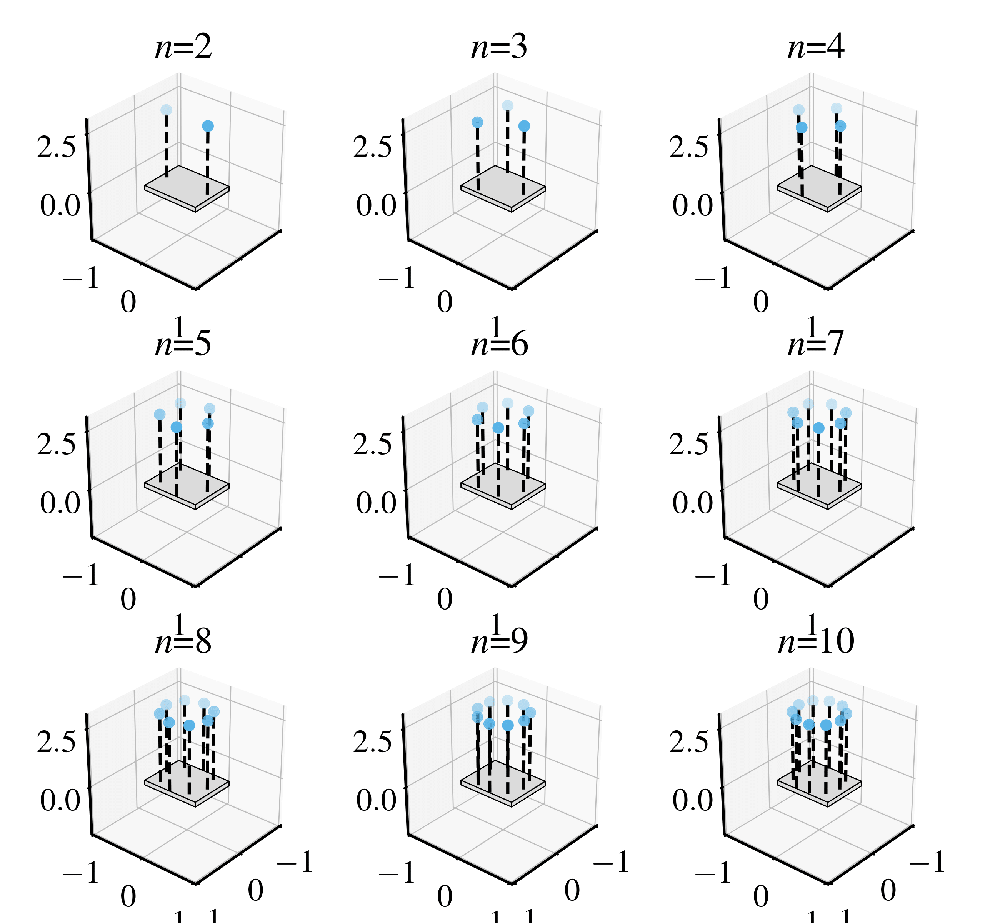
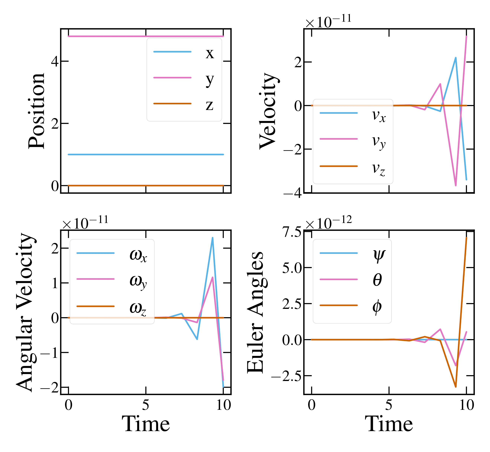
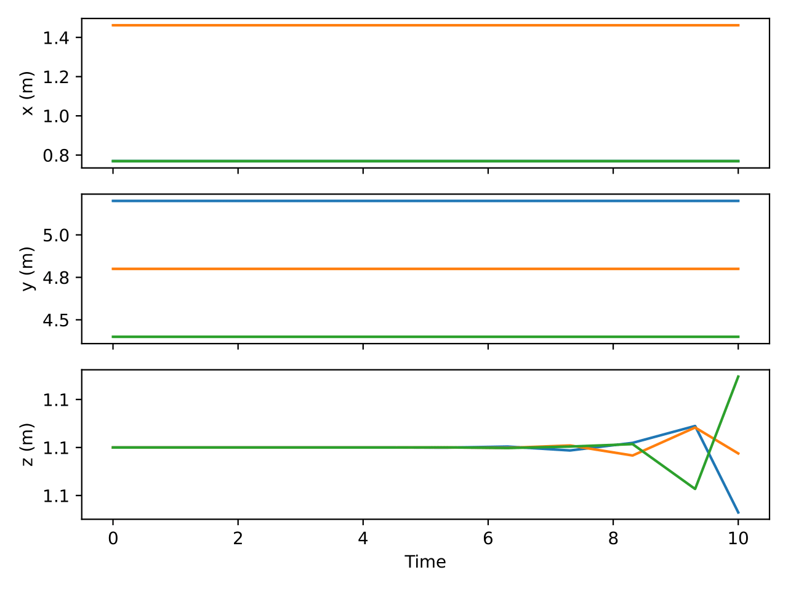
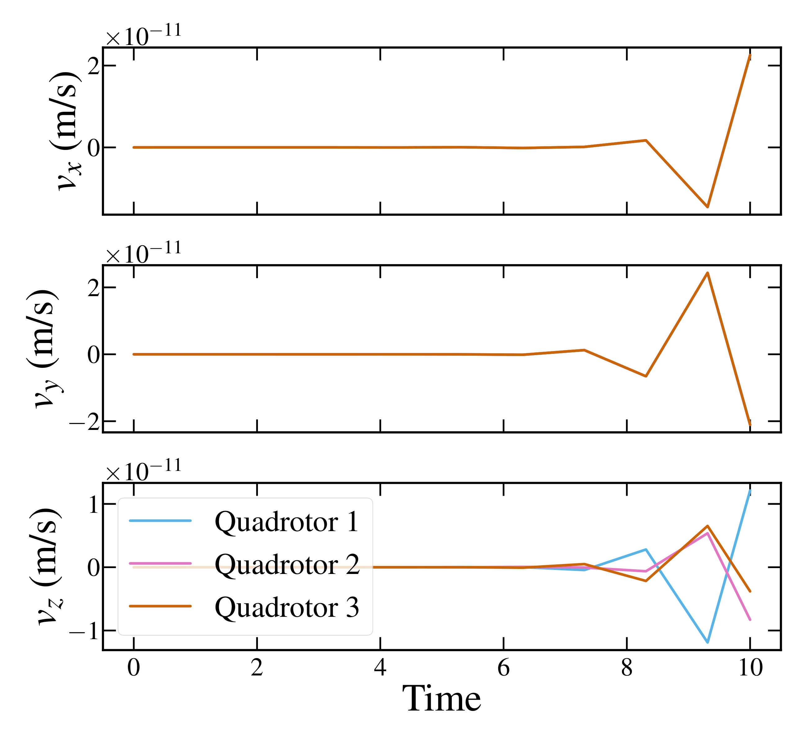

# Swarm-Slung-Payload

<h3>Quadrotor Optimal Configuration 2-D & 3-D</h3>

    

        <h4>Quadrotor Optimal Configuration 2-D</h4>
        
    

    

        <h4>Quadrotor Optimal Configuration 3-D</h4>
        
    

    

        <h4>Payload Dynamics</h4>
        
    

    

        <h4>Link Orientation</h4>
        
    

    

        <h4>Quadrotors Position</h4>
        
    

    

        <h4>Quadrotors Velocity</h4>
        
    

